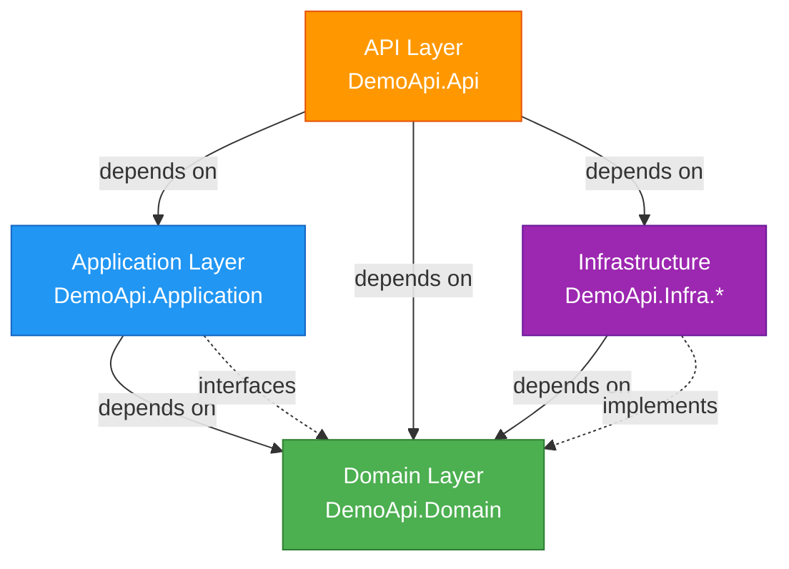

# 🚀 Demo API - Enterprise .NET Architecture Portfolio

> **A progressive demonstration of Clean Architecture, SOLID principles, and modern .NET best practices through three incrementally enhanced REST API implementations.**

[](https://dotnet.microsoft.com/)
[](https://docs.microsoft.com/en-us/dotnet/csharp/)
[](LICENSE)
[](https://blog.cleancoder.com/uncle-bob/2012/08/13/the-clean-architecture.html)

## 📋 Overview

This repository showcases **enterprise-grade .NET development** through three progressively enhanced versions of the same REST API. Each version builds upon the previous one, demonstrating different aspects of production-ready application development:

1. **Core API with Swagger** - Foundation implementation featuring Clean Architecture, comprehensive validation, and API documentation
2. **JWT Authentication** - Adds enterprise security with JWT Bearer tokens and authorization policies
3. **Docker Deployment** - Production-ready containerization with multi-stage builds and security hardening

The project implements a simple Product Management API with full CRUD operations, serving as a vehicle to demonstrate advanced architectural patterns, testing strategies, and DevOps practices. Every architectural decision is intentional, verifiable in the codebase, and represents industry best practices suitable for large-scale enterprise applications.

## 🏗️ Architecture

### Clean Architecture Implementation

This project implements **Clean Architecture** (Onion Architecture) with strict separation of concerns and dependency inversion. The architecture enforces that dependencies flow inward toward the Domain layer, never outward.



### Layer Responsibilities

#### **1. Domain Layer** (`DemoApi.Domain`)
- **Purpose**: Core business logic and enterprise rules
- **Dependencies**: None (pure .NET)
- **Contains**:
  - `Entities/` - Business entities (`Product`)
  - `Interfaces/` - Core abstractions (`IProductRepository`, `INotificatorHandler`)
  - `Handlers/` - Domain handlers (`NotificatorHandler` - Notification pattern implementation)

**Key Implementation**: `INotificatorHandler` defines the contract for collecting business validation errors without throwing exceptions, enabling graceful error aggregation.

#### **2. Application Layer** (`DemoApi.Application`)
- **Purpose**: Application business rules and use cases
- **Dependencies**: Domain layer only
- **Contains**:
  - `Services/` - Application services (`ProductAppService`)
  - `Interfaces/` - Service contracts (`IProductAppService`)
  - `Models/` - DTOs and ViewModels (`ProductViewModel`, `ResponseViewModel`)
  - `Validators/` - FluentValidation validators (`ProductValidator`)
  - `Automapper/` - Object mapping configuration (`AutomapperConfig`)

**Key Implementation**: `ProductAppService` orchestrates business workflows, leveraging `INotificatorHandler` for validation error collection and `IProductRepository` for data access through abstractions.

#### **3. Infrastructure Layer** (`DemoApi.Infra.*`)
- **Purpose**: External concerns and framework integrations
- **Dependencies**: Domain layer (through interfaces)
- **Sub-projects**:
  - `DemoApi.Infra.Data` - Repository implementations (`ProductRepository`)
  - `DemoApi.Infra.CrossCutting` - Cross-cutting concerns (logging with NLog)

**Key Implementation**: `ProductRepository` implements `IProductRepository` from Domain, currently using in-memory storage (easily swappable for EF Core, Dapper, etc.).

#### **4. API Layer** (`DemoApi.Api`)
- **Purpose**: HTTP endpoints, middleware, and framework configuration
- **Dependencies**: All layers (composition root)
- **Contains**:
  - `V1/Controllers/` - Versioned API controllers (`ProductController`)
  - `Configuration/` - Startup configurations (`ApiConfig`, `SwaggerConfig`, `JwtConfig`, etc.)
  - `Extensions/` - Custom middleware (`ExceptionMiddleware`, `FluentValidationFilter`, `ModelValidationFilter`)

**Key Implementation**: `Program.cs` serves as the composition root, wiring up all dependencies using extension methods for clean, modular configuration.

## ✨ Key Features

### 🎯 Design Patterns Implemented

- **Repository Pattern** - `IProductRepository` / `ProductRepository` for data access abstraction
- **Notification Pattern** - `INotificatorHandler` / `NotificatorHandler` for error aggregation without exceptions
- **Dependency Injection** - Native .NET DI container, configured in `DependencyInjectionConfig`
- **Builder Pattern** - Test data builders (`ProductBuilder`, `ProductViewModelBuilder`) using Bogus library
- **Middleware Pipeline** - Custom middleware for exception handling (`ExceptionMiddleware`)
- **Action Filters** - Validation filters (`FluentValidationFilter`, `ModelValidationFilter`)

### 📐 SOLID Principles Evidence

**Single Responsibility Principle (SRP)**
- Each configuration class handles one concern (`ApiConfig`, `SwaggerConfig`, `JwtConfig`, `NLogConfig`, `HostConfig`)
- Validators are isolated per entity (`ProductValidator`)
- Services have focused responsibilities (`ProductAppService`)

**Open/Closed Principle (OCP)**
- Repository pattern allows swapping data sources without modifying business logic
- Middleware pipeline is extensible through configuration

**Liskov Substitution Principle (LSP)**
- Controllers inherit from `MainApiController` maintaining contract consistency
- Repository implementations are fully substitutable

**Interface Segregation Principle (ISP)**
- Focused interfaces: `IProductRepository`, `IProductAppService`, `INotificatorHandler`
- No fat interfaces forcing unnecessary implementations

**Dependency Inversion Principle (DIP)**
- High-level modules (Application, API) depend on abstractions (Domain interfaces)
- `Program.cs` demonstrates DIP: API depends on `IProductRepository` abstraction, not concrete `ProductRepository`

### 🛡️ Security Features

**Server Hardening** (`HostConfig.cs`)
```csharp
builder.WebHost.ConfigureKestrel(options => options.AddServerHeader = false);
```
- Removes `Server` header to prevent information disclosure

**JWT Authentication** (swagger-jwt and swagger-jwt-docker versions)
- Bearer token authentication with symmetric key signing
- Configurable issuer, audience, and expiration
- **Fallback Policy** - Requires authentication by default for all endpoints
```csharp
services.AddAuthorization(options => {
    options.FallbackPolicy = new AuthorizationPolicyBuilder()
        .RequireAuthenticatedUser()
        .Build();
});
```

**Scope Validation** (`DependencyInjectionConfig`)
- `ValidateScopes` and `ValidateOnBuild` enabled for dependency injection

### ✅ Validation Strategy

**Multi-Layer Validation Approach**

1. **FluentValidation** (Preferred) - `ProductValidator`
   - Declarative validation rules
   - Testable and reusable
   - Registered via `FluentValidationFilter`

2. **ModelState Validation** - `ModelValidationFilter`
   - Framework-level validation fallback
   - Suppressed default behavior for custom error responses

3. **Business Validation** - `INotificatorHandler`
   - Domain-specific rules in `ProductAppService`
   - Non-exception-based error collection

### 🧪 Testing Strategy

**Three-Tier Testing Approach**

#### **Unit Tests** (`DemoApi.Application.Tests`)
- **Framework**: xUnit, Moq, FluentAssertions
- **Pattern**: Arrange-Act-Assert
- **Coverage**: Application services with mocked dependencies
- **Test Data**: Builder pattern with Bogus library
- **Examples**: `CreateProductTests`, `UpdateProductTests`, `DeleteProductTests`, `GetProductTests`

**Sample Test Structure:**
```csharp
[Fact]
public async Task Create_ShouldReturnProduct_WhenRepositoryCreatesSuccessfully()
{
    // Arrange - Setup mocks and test data using ProductBuilder
    // Act - Execute the service method
    // Assert - Verify results with FluentAssertions and Moq.Verify
}
```

#### **API Tests** (`DemoApi.Api.Tests`)
- **Framework**: xUnit, WebApplicationFactory, FluentAssertions
- **Pattern**: Integration testing with in-memory server
- **Coverage**: End-to-end API flows
- **Examples**: `ProductApiTests`, `ProductValidationTests`

**Key Component**: `CustomWebApplicationFactory` - Configures test server with real middleware pipeline

#### **Test Builders** (`DemoApi.Tests.Builders`)
- **Purpose**: Fluent test data generation
- **Library**: Bogus (realistic fake data)
- **Builders**: `ProductBuilder`, `ProductViewModelBuilder`
- **Pattern**: Fluent interface for flexible test setup

**Example:**
```csharp
Product product = ProductBuilder.New()
    .WithName("Custom Product")
    .WithWeight(5.5)
    .Build();
```

### 📚 API Documentation

**OpenAPI/Swagger Implementation**

- **Package**: Swashbuckle.AspNetCore (v6.6.2)
- **Configuration**: `SwaggerConfig` with API versioning support
- **Features**:
  - Interactive API explorer at `/swagger`
  - JWT authentication scheme (in jwt versions)
  - XML comments support (if enabled)
  - Versioned endpoints documentation

### 🔄 API Versioning

**Asp.Versioning.Mvc** (v8.1.1)

- **URL Segment**: `/api/v{version}/products`
- **Header**: `X-Api-Version: 1.0`
- **Query String**: `?api-version=1.0`
- **Default Version**: v1.0
- **Configuration**: `ApiConfig.AddApiConfig()`

### 📦 Package Management

**Central Package Management** (`Directory.Packages.props`)

All three versions share consistent package versions:
- **AutoMapper**: 16.0.0
- **FluentValidation**: 12.1.1
- **Asp.Versioning.Mvc**: 8.1.1
- **Swashbuckle.AspNetCore**: 6.6.2
- **NLog.Web.AspNetCore**: 6.1.0
- **Moq**: 4.20.72
- **FluentAssertions**: 8.8.0
- **Bogus**: 35.6.5
- **xUnit**: 2.9.3
- **Microsoft.NET.Test.Sdk**: 18.0.1

### 📝 Structured Logging

**NLog Integration** (`NLogConfig`, `nlog.config`)

- Structured logging to file and console
- Request/response logging
- Exception logging with stack traces
- Configurable log levels per environment

## 🏛️ Project Versions Comparison

| Feature | Swagger | Swagger + JWT | Swagger + JWT + Docker |
|---------|---------|---------------|------------------------|
| **Clean Architecture** | ✅ | ✅ | ✅ |
| **SOLID Principles** | ✅ | ✅ | ✅ |
| **Repository Pattern** | ✅ | ✅ | ✅ |
| **Notification Pattern** | ✅ | ✅ | ✅ |
| **FluentValidation** | ✅ | ✅ | ✅ |
| **AutoMapper** | ✅ | ✅ | ✅ |
| **API Versioning** | ✅ | ✅ | ✅ |
| **Swagger/OpenAPI** | ✅ | ✅ | ✅ |
| **NLog Logging** | ✅ | ✅ | ✅ |
| **Unit Tests** | ✅ | ✅ | ✅ |
| **Integration Tests** | ✅ | ✅ | ✅ |
| **Test Builders (Bogus)** | ✅ | ✅ | ✅ |
| **JWT Authentication** | ❌ | ✅ | ✅ |
| **Authorization Fallback Policy** | ❌ | ✅ | ✅ |
| **Docker Support** | ❌ | ❌ | ✅ |
| **Multi-stage Build** | ❌ | ❌ | ✅ |
| **Docker Compose** | ❌ | ❌ | ✅ |
| **Non-root User** | ❌ | ❌ | ✅ |

## 🧱 Project Structure

```
demo-api/
├── core/
│   ├── swagger/                          # Version 1: Base Implementation
│   │   ├── src/
│   │   │   ├── DemoApi.Api/              # 🌐 API Layer (.NET 10.0)
│   │   │   │   ├── Configuration/        # Startup configs (5 files)
│   │   │   │   │   ├── ApiConfig.cs      # API setup, versioning, filters
│   │   │   │   │   ├── SwaggerConfig.cs  # OpenAPI documentation
│   │   │   │   │   ├── HostConfig.cs     # Kestrel hardening
│   │   │   │   │   ├── NLogConfig.cs     # Logging configuration
│   │   │   │   │   └── DependencyInjectionConfig.cs
│   │   │   │   ├── Controllers/          # Base controller
│   │   │   │   │   └── MainApiController.cs
│   │   │   │   ├── V1/Controllers/       # Versioned endpoints
│   │   │   │   │   └── ProductController.cs
│   │   │   │   ├── Extensions/           # Middleware & Filters
│   │   │   │   │   ├── ExceptionMiddleware.cs
│   │   │   │   │   ├── FluentValidationFilter.cs
│   │   │   │   │   └── ModelValidationFilter.cs
│   │   │   │   ├── Program.cs            # Composition root
│   │   │   │   └── appsettings.json
│   │   │   ├── DemoApi.Application/      # 📋 Application Layer
│   │   │   │   ├── Services/
│   │   │   │   │   ├── ProductAppService.cs
│   │   │   │   │   └── BaseServices.cs
│   │   │   │   ├── Interfaces/
│   │   │   │   │   └── IProductAppService.cs
│   │   │   │   ├── Models/
│   │   │   │   │   ├── Products/
│   │   │   │   │   │   ├── ProductViewModel.cs
│   │   │   │   │   │   ├── ProductResponse.cs
│   │   │   │   │   │   └── ProductListResponse.cs
│   │   │   │   │   └── ResponseViewModel.cs
│   │   │   │   ├── Validators/
│   │   │   │   │   └── Products/
│   │   │   │   │       └── ProductValidator.cs
│   │   │   │   └── Automapper/
│   │   │   │       └── AutomapperConfig.cs
│   │   │   ├── DemoApi.Domain/           # 🧠 Domain Layer
│   │   │   │   ├── Entities/
│   │   │   │   │   ├── Product.cs
│   │   │   │   │   └── Notification.cs
│   │   │   │   ├── Interfaces/
│   │   │   │   │   ├── IProductRepository.cs
│   │   │   │   │   ├── INotificatorHandler.cs
│   │   │   │   │   └── IRepository.cs
│   │   │   │   └── Handlers/
│   │   │   │       └── NotificatorHandler.cs
│   │   │   ├── DemoApi.Infra/            # 🗄️ Data Infrastructure
│   │   │   │   └── Repositories/
│   │   │   │       └── ProductRepository.cs
│   │   │   └── DemoApi.Infra.CrossCutting/ # 🔧 Cross-cutting
│   │   │       ├── Logging/
│   │   │       │   └── LoggingService.cs
│   │   │       ├── Interfaces/
│   │   │       │   └── INotificator.cs
│   │   │       └── nlog.config
│   │   ├── tests/
│   │   │   ├── DemoApi.Application.Tests/  # Unit Tests
│   │   │   │   └── Products/
│   │   │   │       ├── CreateProductTests.cs
│   │   │   │       ├── UpdateProductTests.cs
│   │   │   │       ├── DeleteProductTests.cs
│   │   │   │       ├── GetProductTests.cs
│   │   │   │       └── ProductTests.cs (base class)
│   │   │   ├── DemoApi.Api.Tests/          # Integration Tests
│   │   │   │   ├── Products/
│   │   │   │   │   ├── ProductApiTests.cs
│   │   │   │   │   ├── CreateProductTests.cs
│   │   │   │   │   ├── UpdateProductTests.cs
│   │   │   │   │   ├── DeleteProductTests.cs
│   │   │   │   │   ├── GetProductTests.cs
│   │   │   │   │   └── ProductValidationTests.cs
│   │   │   │   └── Common/
│   │   │   │       ├── Factories/
│   │   │   │       │   └── CustomWebApplicationFactory.cs
│   │   │   │       └── Configuration/
│   │   │   └── DemoApi.Tests.Builders/     # Test Data Builders
│   │   │       └── Products/
│   │   │           ├── ProductBuilder.cs
│   │   │           └── ProductViewModelBuilder.cs
│   │   ├── Directory.Packages.props        # Central package versions
│   │   └── DemoApi.sln
│   │
│   ├── swagger-jwt/                       # Version 2: + JWT Auth
│   │   ├── src/DemoApi.Api/Configuration/
│   │   │   └── JwtConfig.cs               # ⚡ NEW: JWT authentication
│   │   └── (same structure as swagger)
│   │
│   └── swagger-jwt-docker/                # Version 3: + Containerization
│       ├── docker/
│       │   ├── Dockerfile                 # ⚡ NEW: Multi-stage build
│       │   └── docker-compose.yml         # ⚡ NEW: Orchestration
│       ├── .dockerignore
│       └── (same structure as swagger-jwt)
│
└── README.md                              # This file
```

## 🚀 Getting Started

### Prerequisites

- **.NET 10.0 SDK** or later
- **Visual Studio 2026** (v19.0+) or **Visual Studio Code** with C# extension
- **Docker Desktop** (for swagger-jwt-docker version only)
- **Git** for cloning the repository

### Quick Start - Swagger Version

```powershell
# Clone the repository
git clone https://github.com/lucasbarbosa/demo-api.git
cd demo-api/core/swagger

# Restore dependencies (uses Central Package Management)
dotnet restore

# Build the solution
dotnet build

# Run tests
dotnet test --no-build

# Run the API
cd src/DemoApi.Api
dotnet run

# Access Swagger UI
# Navigate to: https://localhost:5001/swagger
```

### Quick Start - JWT Version

```powershell
cd demo-api/core/swagger-jwt

# Configure JWT settings (appsettings.json)
# Add Authorization section with SecurityKey, Sender, ValidOn, ExpirationMinutes

dotnet restore
dotnet build
dotnet test
cd src/DemoApi.Api
dotnet run

# Access Swagger UI with JWT support
# Navigate to: https://localhost:5001/swagger
# Click "Authorize" and enter: Bearer {your-jwt-token}
```

### Quick Start - Docker Version

```powershell
cd demo-api/core/swagger-jwt-docker

# Build and run with Docker Compose
docker-compose -f docker/docker-compose.yml up --build

# API will be available at:
# http://localhost:8080
# https://localhost:8081

# Access Swagger UI
# Navigate to: http://localhost:8080/swagger
```

## 🧪 Running Tests

### All Tests
```powershell
dotnet test
```

### Unit Tests Only
```powershell
dotnet test --filter FullyQualifiedName~DemoApi.Application.Tests
```

### Integration Tests Only
```powershell
dotnet test --filter FullyQualifiedName~DemoApi.Api.Tests
```

### With Coverage
```powershell
dotnet test --collect:"XPlat Code Coverage"
```

## 🔒 Security Implementation Details

### JWT Configuration (swagger-jwt versions)

**appsettings.json structure:**
```json
{
  "Authorization": {
    "SecurityKey": "your-secret-key-min-32-chars",
    "Sender": "DemoApi",
    "ValidOn": "https://localhost:5001",
    "ExpirationMinutes": 60
  }
}
```

**Security validations in `JwtConfig.cs`:**
- ✅ Configuration presence validation
- ✅ SecurityKey minimum length (32 characters)
- ✅ Issuer and audience validation
- ✅ Token lifetime validation
- ✅ Clock skew set to zero (strict expiration)
- ✅ HTTPS metadata requirement

### Docker Security (swagger-jwt-docker)

**Multi-stage build** reduces attack surface:
1. **Build stage** - Uses SDK image (larger)
2. **Publish stage** - Optimizes output
3. **Final stage** - Uses minimal ASP.NET runtime image

**Security hardening:**
- Non-root user (`USER app` - default in .NET 10)
- Minimal base image (aspnet runtime only)
- No unnecessary tools in production image
- Explicit port exposure (8080, 8081)

## 📖 API Documentation

### Swagger Endpoints

Each version exposes Swagger UI at:
- **Swagger Version**: `https://localhost:5001/swagger`
- **JWT Version**: `https://localhost:5001/swagger` (with authentication UI)
- **Docker Version**: `http://localhost:8080/swagger`

### Product API Endpoints

| Method | Endpoint | Description | Request Body | Response |
|--------|----------|-------------|--------------|----------|
| GET | `/api/v1/products` | Get all products | - | `ProductListResponse` |
| GET | `/api/v1/products/{id}` | Get product by ID | - | `ProductResponse` |
| POST | `/api/v1/products` | Create new product | `ProductViewModel` | `ProductResponse` (201) |
| PUT | `/api/v1/products` | Update existing product | `ProductViewModel` | 204 No Content |
| DELETE | `/api/v1/products/{id}` | Delete product | - | 204 No Content |

### Response Structure

**Success (200/201):**
```json
{
  "success": true,
  "data": {
    "id": 1,
    "name": "Product Name",
    "weight": 5.5
  },
  "errors": []
}
```

**Validation Error (400):**
```json
{
  "success": false,
  "data": null,
  "errors": [
    "Name is required",
    "Weight must be greater than 0"
  ]
}
```

**Business Error (412 Precondition Failed):**
```json
{
  "success": false,
  "data": null,
  "errors": [
    "Product (Product Name) is already registered"
  ]
}
```

## 🛠️ Configuration

### Environment Variables

| Variable | Description | Default | Required |
|----------|-------------|---------|----------|
| `ASPNETCORE_ENVIRONMENT` | Environment name | `Production` | No |
| `ASPNETCORE_URLS` | Listening URLs | `http://+:8080;https://+:8081` | No |
| `Authorization__SecurityKey` | JWT secret key | - | Yes (JWT versions) |
| `Authorization__Sender` | JWT issuer | - | Yes (JWT versions) |
| `Authorization__ValidOn` | JWT audience | - | Yes (JWT versions) |
| `Authorization__ExpirationMinutes` | Token lifetime | `60` | No |

### Logging Configuration

**NLog targets** (configured in `nlog.config`):
- Console output with colored levels
- File output: `logs/demo-api-{date}.log`
- Request/response logging
- Exception details with stack traces

## 🤝 Contributing

### Code Standards

- **C# Conventions**: Follow Microsoft C# coding conventions
- **Architecture**: Maintain Clean Architecture boundaries
- **SOLID**: Ensure new code adheres to SOLID principles
- **Testing**: Minimum 80% code coverage for new features
- **Validation**: Use FluentValidation for input validation
- **Error Handling**: Use Notification pattern for business errors
- **Logging**: Structured logging with NLog

### Pull Request Process

1. Create feature branch from `main`
2. Implement changes following code standards
3. Add/update unit and integration tests
4. Ensure all tests pass (`dotnet test`)
5. Update relevant documentation
6. Submit PR with detailed description

## 📄 License

This project is licensed under the MIT License - see the LICENSE file for details.

---

## 🎯 Interview Talking Points

This repository demonstrates:

✅ **Architectural Mastery**
- Clean Architecture with verifiable dependency rules
- Four-layer separation (API, Application, Domain, Infrastructure)
- Composition root pattern in `Program.cs`

✅ **Design Pattern Expertise**
- Repository, Notification, Builder, Middleware, Filter patterns
- All patterns implemented and testable

✅ **SOLID Principles**
- Each principle demonstrated with concrete examples
- Dependency Inversion through interfaces
- Single Responsibility in configuration classes

✅ **Production-Ready Practices**
- Comprehensive testing (unit + integration)
- Security hardening (server header removal, JWT, Docker non-root user)
- Structured logging
- Central package management
- API versioning
- Docker containerization

✅ **Modern .NET Proficiency**
- .NET 10 with latest C# features
- Minimal APIs patterns (top-level statements)
- Native DI container
- Latest package versions

✅ **Testing Excellence**
- Builder pattern for test data
- WebApplicationFactory for integration tests
- Moq + FluentAssertions for expressive tests
- Bogus for realistic fake data

---

**For version-specific documentation, see:**
- [Swagger Version README](core/swagger/README.md)
- [JWT Version README](core/swagger-jwt/README.md)
- [Docker Version README](core/swagger-jwt-docker/README.md)