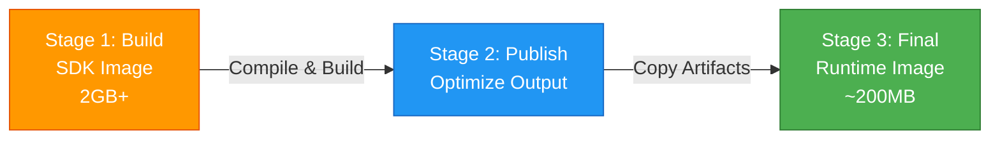

# Demo API - Docker Containerized Version

**Production-ready containerized REST API with JWT authentication and multi-stage Docker builds**

## 📋 Quick Overview

This is the **complete production-ready implementation** of the Demo API, adding containerization and orchestration to the JWT-secured application. It demonstrates DevOps best practices for deploying .NET applications to cloud environments or on-premises container platforms.

This version demonstrates all features from previous versions, plus:
- ✅ **Multi-Stage Docker Build** - Optimized container images with minimal attack surface
- ✅ **Docker Compose Orchestration** - Simple deployment with infrastructure as code
- ✅ **Security Hardening** - Non-root user execution (default in .NET 10)
- ✅ **Production Optimization** - Separated build and runtime environments
- ✅ **Port Configuration** - HTTP (8080) and HTTPS (8081) exposure

## 🎯 Key Differences from Other Versions

### What This Version Adds (vs JWT)

**New Files:**
- `docker/Dockerfile` - Multi-stage container build
- `docker/docker-compose.yml` - Service orchestration
- `.dockerignore` - Build context optimization

**Deployment Advantages:**
- 🐳 Containerized deployment (Docker/Kubernetes ready)
- 📦 Consistent runtime environment across all stages
- ⚡ Optimized image size (~200MB runtime vs ~2GB SDK)
- 🔒 Enhanced security with minimal base image
- 🚀 Simple scaling with container orchestration
- 🔧 Environment-based configuration

### Version Comparison

| Feature | Swagger | JWT | **This Version (Docker)** |
|---------|---------|-----|---------------------------|
| Authentication | ❌ | ✅ | ✅ |
| Authorization | ❌ | ✅ | ✅ |
| Local Deployment | ✅ | ✅ | ✅ |
| **Container Deployment** | ❌ | ❌ | ✅ Docker |
| **Multi-stage Build** | ❌ | ❌ | ✅ 3 stages |
| **Production Optimized** | ❌ | ❌ | ✅ Minimal runtime |
| **Orchestration Ready** | ❌ | ❌ | ✅ Docker Compose |

## 🐳 Docker Architecture

### Multi-Stage Build Strategy

The `Dockerfile` uses three distinct stages to optimize both build time and final image size:



### Dockerfile Breakdown

```dockerfile
# ============================================
# Stage 1: Build
# ============================================
FROM mcr.microsoft.com/dotnet/sdk:10.0 AS build
WORKDIR /src

# Copy project files and restore dependencies
COPY ["Directory.Packages.props", "."]
COPY ["src/DemoApi.Api/DemoApi.Api.csproj", "src/DemoApi.Api/"]
COPY ["src/DemoApi.Application/DemoApi.Application.csproj", "src/DemoApi.Application/"]
COPY ["src/DemoApi.Domain/DemoApi.Domain.csproj", "src/DemoApi.Domain/"]
COPY ["src/DemoApi.Infra.CrossCutting/DemoApi.Infra.CrossCutting.csproj", "src/DemoApi.Infra.CrossCutting/"]
COPY ["src/DemoApi.Infra/DemoApi.Infra.Data.csproj", "src/DemoApi.Infra/"]

RUN dotnet restore "src/DemoApi.Api/DemoApi.Api.csproj"

# Copy all source code and build
COPY . .
WORKDIR "/src/src/DemoApi.Api"
RUN dotnet build "DemoApi.Api.csproj" -c Release -o /app/build

# ============================================
# Stage 2: Publish
# ============================================
FROM build AS publish
RUN dotnet publish "DemoApi.Api.csproj" -c Release -o /app/publish /p:UseAppHost=false

# ============================================
# Stage 3: Final Runtime Image
# ============================================
FROM mcr.microsoft.com/dotnet/aspnet:10.0 AS final
WORKDIR /app
EXPOSE 8080
EXPOSE 8081

# Configure non-root user for security (default in .NET 10)
USER app

COPY --from=publish /app/publish .
ENTRYPOINT ["dotnet", "DemoApi.Api.dll"]
```

### Stage Details

**Stage 1: Build**
- Base Image: `mcr.microsoft.com/dotnet/sdk:10.0` (~2GB)
- Purpose: Compile C# code, restore NuGet packages
- Contains: Full .NET SDK, build tools, compilers
- Output: Built assemblies in `/app/build`

**Stage 2: Publish**
- Base Image: Inherits from `build` stage
- Purpose: Optimize application for production
- Actions: Trim unused code, optimize assemblies
- Output: Published application in `/app/publish`

**Stage 3: Final**
- Base Image: `mcr.microsoft.com/dotnet/aspnet:10.0` (~200MB)
- Purpose: Minimal runtime environment
- Contains: Only ASP.NET runtime (no SDK, no build tools)
- Security: Runs as non-root `app` user
- Result: **~90% size reduction** vs including SDK

### Security Features

✅ **Minimal Attack Surface**
- Runtime image contains only necessary binaries
- No build tools, compilers, or SDKs in production image
- Reduced potential for exploitation

✅ **Non-Root User Execution**
```dockerfile
USER app  # Default in .NET 10 images
```
- Prevents privilege escalation
- Limits damage from container breakout
- Aligns with Kubernetes pod security policies

✅ **Explicit Port Exposure**
```dockerfile
EXPOSE 8080   # HTTP
EXPOSE 8081   # HTTPS
```
- Documents network surface
- Enables port scanning security tools

✅ **.dockerignore Optimization**
Excludes unnecessary files from build context:
```
**/.git
**/.vs
**/bin
**/obj
**/node_modules
**/.DS_Store
**/secrets.json
```

## 🚀 Running This Version

### Prerequisites
- **Docker Desktop** (Windows, macOS, or Linux)
  - Docker Engine 20.10+
  - Docker Compose 2.0+
- (Optional) Visual Studio 2026 with Docker support

### Quick Start with Docker Compose

```powershell
# Navigate to this version's directory
cd d:\Projects\Git\lucasbarbosa\demo-api\core\swagger-jwt-docker

# Build and start the container
docker-compose -f docker/docker-compose.yml up --build

# The API will be running on:
# HTTP:  http://localhost:8080
# HTTPS: https://localhost:8081
# Swagger: http://localhost:8080/swagger
```

### Quick Start with Docker CLI

```powershell
# Build the image
docker build -f docker/Dockerfile -t demo-api:latest .

# Run the container
docker run -d -p 8080:8080 -p 8081:8081 `
  -e Authorization__SecurityKey="your-secret-key-min-32-chars" `
  -e Authorization__Sender="DemoApi" `
  -e Authorization__ValidOn="http://localhost:8080" `
  -e Authorization__ExpirationMinutes="60" `
  --name demo-api `
  demo-api:latest

# View logs
docker logs -f demo-api

# Stop the container
docker stop demo-api

# Remove the container
docker rm demo-api
```

### Docker Compose Configuration

**docker/docker-compose.yml:**
```yaml
version: '3.8'

services:
  api:
    build:
      context: ..
      dockerfile: docker/Dockerfile
    container_name: demo-api
    ports:
      - "8080:8080"
      - "8081:8081"
    environment:
      - ASPNETCORE_ENVIRONMENT=Development
      - ASPNETCORE_URLS=http://+:8080;https://+:8081
      - Authorization__SecurityKey=${JWT_SECRET_KEY:-your-super-secret-key-min-32-characters-long}
      - Authorization__Sender=DemoApi
      - Authorization__ValidOn=http://localhost:8080
      - Authorization__ExpirationMinutes=60
    restart: unless-stopped
```

### Environment Variables

**Required for JWT:**

```powershell
# Windows PowerShell
$env:JWT_SECRET_KEY = "production-secret-key-from-vault"

# Linux/macOS
export JWT_SECRET_KEY="production-secret-key-from-vault"

# Then run
docker-compose -f docker/docker-compose.yml up
```

**All Supported Variables:**

| Variable | Description | Default | Example |
|----------|-------------|---------|---------|
| `ASPNETCORE_ENVIRONMENT` | Environment name | `Production` | `Development` |
| `ASPNETCORE_URLS` | Listening URLs | `http://+:8080;https://+:8081` | Custom ports |
| `Authorization__SecurityKey` | JWT signing key | - | `${JWT_SECRET_KEY}` |
| `Authorization__Sender` | JWT issuer | - | `DemoApi` |
| `Authorization__ValidOn` | JWT audience | - | `http://localhost:8080` |
| `Authorization__ExpirationMinutes` | Token lifetime | - | `60` |

## 📦 Container Management

### Building the Image

```powershell
# Build with specific tag
docker build -f docker/Dockerfile -t demo-api:v1.0.0 .

# Build with latest tag
docker build -f docker/Dockerfile -t demo-api:latest .

# Build with no cache (clean build)
docker build --no-cache -f docker/Dockerfile -t demo-api:latest .
```

### Running Containers

```powershell
# Run in detached mode
docker run -d -p 8080:8080 -p 8081:8081 demo-api:latest

# Run with custom name
docker run -d -p 8080:8080 --name my-demo-api demo-api:latest

# Run with environment file
docker run -d -p 8080:8080 --env-file .env demo-api:latest

# Run in interactive mode (for debugging)
docker run -it -p 8080:8080 demo-api:latest
```

### Inspecting Containers

```powershell
# List running containers
docker ps

# View container logs
docker logs demo-api

# Follow logs in real-time
docker logs -f demo-api

# Execute command in running container
docker exec -it demo-api /bin/bash

# Inspect container details
docker inspect demo-api

# View resource usage
docker stats demo-api
```

### Stopping and Removing

```powershell
# Stop container
docker stop demo-api

# Start stopped container
docker start demo-api

# Restart container
docker restart demo-api

# Remove container
docker rm demo-api

# Remove container (force)
docker rm -f demo-api

# Stop and remove with Docker Compose
docker-compose -f docker/docker-compose.yml down
```

## 🧪 Testing the Containerized API

### Health Check

```powershell
# Check if API is responding
curl http://localhost:8080/api/v1/products

# Check Swagger UI
# Open browser: http://localhost:8080/swagger
```

### Full CRUD Test

```powershell
# 1. Generate JWT token (see JWT version README for details)
$token = "your-generated-jwt-token"

# 2. Create a product
curl -X POST http://localhost:8080/api/v1/products `
  -H "Content-Type: application/json" `
  -H "Authorization: Bearer $token" `
  -d '{"name": "Docker Product", "weight": 3.5}'

# 3. Get all products
curl -H "Authorization: Bearer $token" http://localhost:8080/api/v1/products

# 4. Get specific product
curl -H "Authorization: Bearer $token" http://localhost:8080/api/v1/products/1

# 5. Update product
curl -X PUT http://localhost:8080/api/v1/products `
  -H "Content-Type: application/json" `
  -H "Authorization: Bearer $token" `
  -d '{"id": 1, "name": "Updated Docker Product", "weight": 5.0}'

# 6. Delete product
curl -X DELETE -H "Authorization: Bearer $token" http://localhost:8080/api/v1/products/1
```

## 🚢 Production Deployment

### Container Registry

**Push to Docker Hub:**
```powershell
# Tag for Docker Hub
docker tag demo-api:latest username/demo-api:latest
docker tag demo-api:latest username/demo-api:1.0.0

# Login to Docker Hub
docker login

# Push images
docker push username/demo-api:latest
docker push username/demo-api:1.0.0
```

**Push to Azure Container Registry:**
```powershell
# Login to ACR
az acr login --name myregistry

# Tag for ACR
docker tag demo-api:latest myregistry.azurecr.io/demo-api:latest

# Push to ACR
docker push myregistry.azurecr.io/demo-api:latest
```

### Kubernetes Deployment

**Sample deployment.yaml:**
```yaml
apiVersion: apps/v1
kind: Deployment
metadata:
  name: demo-api
spec:
  replicas: 3
  selector:
    matchLabels:
      app: demo-api
  template:
    metadata:
      labels:
        app: demo-api
    spec:
      containers:
      - name: api
        image: username/demo-api:latest
        ports:
        - containerPort: 8080
        env:
        - name: Authorization__SecurityKey
          valueFrom:
            secretKeyRef:
              name: jwt-secret
              key: secret-key
        - name: Authorization__Sender
          value: "DemoApi"
        - name: Authorization__ValidOn
          value: "https://api.production.com"
        resources:
          limits:
            memory: "512Mi"
            cpu: "500m"
          requests:
            memory: "256Mi"
            cpu: "250m"
---
apiVersion: v1
kind: Service
metadata:
  name: demo-api-service
spec:
  selector:
    app: demo-api
  ports:
  - protocol: TCP
    port: 80
    targetPort: 8080
  type: LoadBalancer
```

**Deploy to Kubernetes:**
```powershell
kubectl apply -f deployment.yaml
kubectl get pods
kubectl get services
kubectl logs -l app=demo-api
```

### Azure App Service (Container)

```powershell
# Create Azure App Service with container
az webapp create `
  --resource-group myResourceGroup `
  --plan myPlan `
  --name demo-api-app `
  --deployment-container-image-name username/demo-api:latest

# Configure environment variables
az webapp config appsettings set `
  --resource-group myResourceGroup `
  --name demo-api-app `
  --settings Authorization__SecurityKey="production-key"

# Enable HTTPS
az webapp update `
  --resource-group myResourceGroup `
  --name demo-api-app `
  --https-only true
```

## 🏗️ Architecture for Containers

### Container Filesystem Layout

```
/app/                           # Working directory
├── DemoApi.Api.dll             # Main assembly
├── DemoApi.Api.deps.json       # Dependencies manifest
├── DemoApi.Api.runtimeconfig.json
├── DemoApi.Application.dll
├── DemoApi.Domain.dll
├── DemoApi.Infra.Data.dll
├── DemoApi.Infra.CrossCutting.dll
├── AutoMapper.dll
├── FluentValidation.dll
├── Swashbuckle.AspNetCore.*.dll
└── (other dependencies)
```

### Network Architecture

```
Host Machine                Container
┌─────────────────┐        ┌──────────────────┐
│                 │        │                  │
│ localhost:8080  ├───────►│ 8080 (HTTP)      │
│                 │        │                  │
│ localhost:8081  ├───────►│ 8081 (HTTPS)     │
│                 │        │                  │
└─────────────────┘        └──────────────────┘
```

### Volume Mounts (Optional)

For persistent logs:
```powershell
docker run -d -p 8080:8080 `
  -v ${PWD}/logs:/app/logs `
  demo-api:latest
```

## ⚙️ Configuration Best Practices

### Secrets Management

**❌ Don't:**
```dockerfile
# Never hardcode secrets in Dockerfile
ENV Authorization__SecurityKey="hardcoded-secret"
```

**✅ Do:**
```powershell
# Use environment variables
docker run -e Authorization__SecurityKey="${SECRET_FROM_VAULT}" demo-api:latest

# Or use Docker secrets (Swarm/Kubernetes)
docker secret create jwt_key jwt_secret.txt
```

### Environment-Specific Configs

```powershell
# Development
docker run -e ASPNETCORE_ENVIRONMENT=Development demo-api:latest

# Staging
docker run -e ASPNETCORE_ENVIRONMENT=Staging demo-api:latest

# Production
docker run -e ASPNETCORE_ENVIRONMENT=Production demo-api:latest
```

## 📈 Performance Optimization

### Image Size Comparison

| Stage | Base Image | Size | Purpose |
|-------|------------|------|---------|
| Build | .NET SDK 10.0 | ~2 GB | Compilation |
| Final | .NET ASP.NET 10.0 | ~200 MB | Runtime |

**Savings: ~90% reduction**

### Build Cache Optimization

The Dockerfile copies `.csproj` files first:
```dockerfile
COPY ["src/DemoApi.Api/DemoApi.Api.csproj", "src/DemoApi.Api/"]
# ... other project files
RUN dotnet restore
```

**Benefits:**
- ✅ Layers are cached if only code changes (not dependencies)
- ✅ Faster subsequent builds
- ✅ Reduced CI/CD pipeline time

### Resource Limits

```yaml
# docker-compose.yml
services:
  api:
    deploy:
      resources:
        limits:
          cpus: '0.50'
          memory: 512M
        reservations:
          cpus: '0.25'
          memory: 256M
```

## 🔍 Troubleshooting

### Container Won't Start

```powershell
# View container logs
docker logs demo-api

# Common issues:
# 1. Missing JWT configuration → Check environment variables
# 2. Port conflict → Use different ports (-p 9080:8080)
# 3. Permission denied → Check USER instruction in Dockerfile
```

### Can't Access API

```powershell
# Check if container is running
docker ps

# Check port mappings
docker port demo-api

# Test from inside container
docker exec -it demo-api curl http://localhost:8080/api/v1/products
```

### Build Failures

```powershell
# Clean build (no cache)
docker build --no-cache -f docker/Dockerfile -t demo-api:latest .

# Check build context size
docker build -f docker/Dockerfile -t demo-api:latest . --progress=plain

# Verify .dockerignore is working
```

## 📚 Additional Resources

### Official Documentation
- [.NET Docker Images](https://hub.docker.com/_/microsoft-dotnet)
- [Docker Best Practices](https://docs.docker.com/develop/dev-best-practices/)
- [ASP.NET Core in Docker](https://docs.microsoft.com/en-us/aspnet/core/host-and-deploy/docker/)

### Related Versions
- 📘 [Swagger Version (Base)](../swagger/README.md)
- 📘 [JWT Version (Authentication)](../swagger-jwt/README.md)
- 📘 [Root Documentation](../../README.md)

---

## 🎯 Production Checklist

Before deploying to production:

- [ ] **Security**
  - [ ] Use secrets manager for JWT key (Azure Key Vault, AWS Secrets Manager)
  - [ ] Enable HTTPS only
  - [ ] Scan image for vulnerabilities (`docker scan demo-api:latest`)
  - [ ] Run as non-root user (already configured)
  - [ ] Use minimal base image (already configured)

- [ ] **Configuration**
  - [ ] Set `ASPNETCORE_ENVIRONMENT=Production`
  - [ ] Configure production `Authorization__ValidOn`
  - [ ] Set appropriate token expiration
  - [ ] Disable Swagger in production (optional)

- [ ] **Monitoring**
  - [ ] Set up health checks
  - [ ] Configure logging aggregation
  - [ ] Enable application insights
  - [ ] Set up container resource monitoring

- [ ] **Scaling**
  - [ ] Define resource limits
  - [ ] Configure horizontal pod autoscaling (Kubernetes)
  - [ ] Set up load balancer
  - [ ] Test under load

- [ ] **Backup & Recovery**
  - [ ] Document recovery procedures
  - [ ] Test container restart scenarios
  - [ ] Version Docker images with tags

---

**For comprehensive architectural documentation, see:**  
📘 [Root README](../../README.md)